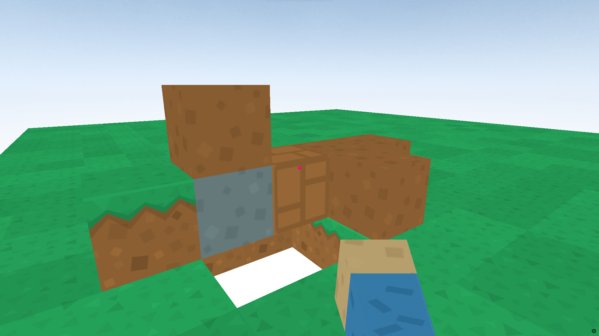

# Minecraft using Ursina Python

This repository contains a Minecraft-like game built using the Ursina game engine in Python. The game allows players to explore a blocky world, build structures, and interact with the environment.

🎮 Gameplay Screenshot:



## Features 🚀

- Block-based world: The game world is composed of various blocks that players can place, break, and interact with.
- Player movement: Players can move around the world, jump, and navigate through the environment.
- Block interaction: Players can interact with blocks, such as breaking them to collect resources or placing them to build structures.
- Day and night cycle: The game features a dynamic day and night cycle, creating a more immersive experience.
- Simple controls: The controls are designed to be intuitive and easy to grasp, allowing players to quickly get into the game.

## Installation ⚙️

1. Clone the repository:

```bash
git clone https://github.com/your-username/minecraft-ursina.git
```

2. Navigate to the project directory:

```bash
cd minecraft-ursina
```

3. Install the required dependencies. It is recommended to use a virtual environment:

```bash
python3 -m venv venv
source venv/bin/activate
pip install -r requirements.txt
```

4. Run the game:

```bash
python main.py
```

## Controls 🎮

- **WASD**: Move forward, left, backward, and right.
- **Space**: Jump.
- **Left Mouse Button**: Break blocks.
- **Right Mouse Button**: Place blocks.
- **1234**: Switch between different block types.

## Contributing 🤝

Contributions are welcome! If you have any ideas, bug fixes, or improvements, please submit a pull request. Make sure to follow the repository's code style and guidelines.

## License 📝

This project is licensed under the [The Unlicense](LICENSE). You are free to use, modify, and distribute this code as long as you include the original license file.

## Acknowledgments 🙏

- The Ursina game engine: [Ursina](https://www.ursinaengine.org/)
- Minecraft for the inspiration
<!-- - The amazing open-source community for their contributions and support -->
